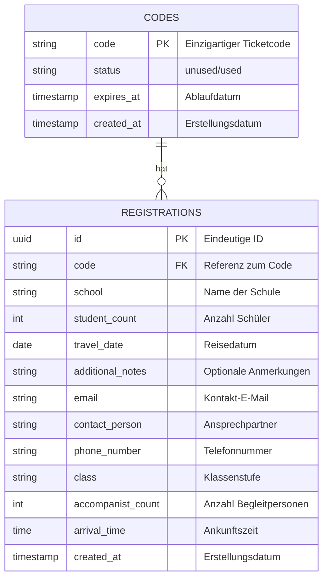

# ZVV Ticketcode-Validierung mit Supabase & Next.js

## Problemstellung
Aktuell wird die Bestellcode-Verwaltung für die ZVV-Entdeckungsreise über Google Sheets gehandhabt. Google Sheets hat jedoch eine **500-Zeilen-Grenze**, was langfristig zu Skalierungsproblemen führt. Jährlich werden ca. **650 neue Codes generiert** und diese bleiben **drei Jahre gültig**. Das bestehende Modell ist nicht nachhaltig.

## Ziel
Eine skalierbare, performante Lösung zur Verwaltung und Validierung von Ticketcodes unter Nutzung von **Supabase** als zentrale Datenbank und einer **Next.js-Anwendung** auf **Vercel** für die Benutzeroberfläche und API-Funktionalität.

## Architektur
- **Supabase (PostgreSQL)** als **zentrale Datenbank** für Codes und Anmeldungen.
- **Vercel (Next.js)** für die Benutzeroberfläche und API-Endpunkte.
- **Resend** für den E-Mail-Versand von Bestätigungen und Benachrichtigungen.

## Technologie-Stack
- **Supabase (PostgreSQL)** für Speicherung & Validierung der Codes.
- **Next.js** für Frontend und API-Routes.
- **Vercel** für Hosting und Serverless-Funktionen.
- **Resend** für transaktionale E-Mails.

## Datenbank-Struktur (Supabase)

### Datenbankschema

Die Anwendung verwendet zwei Haupttabellen: `codes` für die Ticketcodes und `registrations` für die Anmeldungen.

#### ER-Diagramm



#### Tabellenstruktur

##### Tabelle: `codes`

| Spalte | Typ | Constraints | Beschreibung |
|--------|-----|-------------|-------------|
| code | TEXT | PRIMARY KEY | Einzigartiger Ticketcode |
| status | TEXT | DEFAULT 'unused', CHECK (status IN ('unused', 'used')) | Status des Codes (unused/used) |
| expires_at | TIMESTAMP | NOT NULL | Ablaufdatum des Codes (3 Jahre nach Erstellung) |
| created_at | TIMESTAMP | DEFAULT now() | Erstellungsdatum |

##### Tabelle: `registrations`

| Spalte | Typ | Constraints | Beschreibung |
|--------|-----|-------------|-------------|
| id | UUID | PRIMARY KEY, DEFAULT gen_random_uuid() | Eindeutige ID der Anmeldung |
| code | TEXT | REFERENCES codes(code) | Referenz zum eingelösten Code |
| school | TEXT | NOT NULL | Name der Schule |
| student_count | INTEGER | NOT NULL | Anzahl der Schüler |
| travel_date | DATE | NOT NULL | Gewünschtes Reisedatum |
| additional_notes | TEXT | | Zusätzliche Anmerkungen (optional) |
| email | TEXT | NOT NULL | E-Mail-Adresse für die Bestätigung |
| contact_person | TEXT | NOT NULL | Name der Kontaktperson |
| phone_number | TEXT | NOT NULL | Telefonnummer der Kontaktperson |
| class | TEXT | NOT NULL | Klassenstufe (z.B. "4. Klasse") |
| accompanist_count | INTEGER | NOT NULL | Anzahl der Begleitpersonen |
| arrival_time | TIME | NOT NULL | Geplante Ankunftszeit |
| created_at | TIMESTAMP | DEFAULT now() | Erstellungsdatum der Anmeldung |

#### SQL-Definitionen

```sql
-- Tabelle für Ticketcodes
CREATE TABLE codes (
    code TEXT PRIMARY KEY,
    status TEXT DEFAULT 'unused' CHECK (status IN ('unused', 'used')),
    expires_at TIMESTAMP NOT NULL,
    created_at TIMESTAMP DEFAULT now()
);

-- Tabelle für Anmeldungen
CREATE TABLE registrations (
    id UUID DEFAULT gen_random_uuid() PRIMARY KEY,
    code TEXT REFERENCES codes(code),
    school TEXT NOT NULL,
    student_count INTEGER NOT NULL,
    travel_date DATE NOT NULL,
    additional_notes TEXT,
    email TEXT NOT NULL,
    contact_person TEXT NOT NULL,
    phone_number TEXT NOT NULL,
    class TEXT NOT NULL,
    accompanist_count INTEGER NOT NULL,
    arrival_time TIME NOT NULL,
    created_at TIMESTAMP DEFAULT now()
);
```

#### Beziehungen

- Ein Code (`codes`) kann höchstens eine Anmeldung (`registrations`) haben (1:0..1)
- Eine Anmeldung (`registrations`) gehört genau zu einem Code (`codes`) (1:1)

## Funktionalitäten
### **1. Code-Validierung**
- API-Endpunkt: `POST /api/validate`
- Überprüft, ob ein Ticketcode gültig ist.

### **2. Code-Einlösung mit Anmeldeformular**
- Einfaches Formular mit folgenden Feldern:
  - Code
  - Schule
  - Kontaktperson
  - E-Mail-Adresse
  - Telefonnummer
  - Klasse (Dropdown-Menü)
  - Anzahl Schüler
  - Anzahl Begleitpersonen
  - Gewünschtes Reisedatum
  - Ankunftszeit
  - Zusätzliche Anmerkung
- API-Endpunkt: `POST /api/redeem`
- Validiert den Code und speichert die Anmeldedaten.

### **3. E-Mail-Benachrichtigungen**
- **Bestätigungs-E-Mail** an den Benutzer nach erfolgreicher Anmeldung.
- **Benachrichtigungs-E-Mail** an den Administrator mit den Anmeldedetails.

## Best Practices
- **Supabase Row-Level Security (RLS)** aktivieren, um Datenzugriff abzusichern.
- **Serverless-Funktionen** für optimale Skalierbarkeit.
- **Formularvalidierung** sowohl client- als auch serverseitig.
- **Transaktionale E-Mails** für Bestätigungen und Benachrichtigungen.

## Implementierte Funktionen
1. **Anmeldeformular erstellt** mit allen erforderlichen Feldern.
2. **Datenbank-Tabellen in Supabase eingerichtet** für Codes und Anmeldungen.
3. **API-Endpunkte implementiert** für Validierung und Einlösung von Codes.
4. **E-Mail-Funktionalität integriert** für Bestätigungen und Benachrichtigungen.
5. **Bestätigungsseite nach erfolgreicher Anmeldung erstellt**.

## Erste Schritte
1. Klone das Repository:
   ```bash
   git clone https://github.com/dein-username/zvv-entdeckungsreise.git
   cd zvv-entdeckungsreise
   ```

2. Installiere die Abhängigkeiten:
   ```bash
   npm install
   ```

3. Erstelle eine `.env.local` Datei mit den erforderlichen Umgebungsvariablen:
   ```
   NEXT_PUBLIC_SUPABASE_URL=deine-supabase-url
   SUPABASE_SERVICE_ROLE_KEY=dein-service-role-key
   RESEND_API_KEY=dein-resend-api-key
   EMAIL_FROM=noreply@zvv.ch
   ADMIN_EMAIL=ict@zvv.zh.ch
   ```

   **Hinweis zur E-Mail-Konfiguration:**
   - `EMAIL_FROM`: Die E-Mail-Adresse, die als Absender für alle E-Mails verwendet wird (z.B. `entdeckungsreise@zvv.ch`). Fallback: `noreply@zvv.ch`
   - `ADMIN_EMAIL`: Die E-Mail-Adresse, an die Benachrichtigungen über neue Anmeldungen gesendet werden und die als Reply-To-Adresse in den Bestätigungs-E-Mails verwendet wird. Fallback: `ict@zvv.zh.ch`

4. Starte die Entwicklungsumgebung:
   ```bash
   npm run dev
   ```

## Fazit
Diese Lösung macht den Bestellprozess **skalierbar, sicher und benutzerfreundlich**. Durch die direkte Integration des Anmeldeformulars in die Next.js-Anwendung wird der Prozess vereinfacht und die Abhängigkeit von Drittanbietern wie Typeform und Zapier eliminiert. Die E-Mail-Funktionalität sorgt für eine nahtlose Kommunikation mit den Benutzern und Administratoren.

## Datenbank-Setup

Die Anwendung verwendet Supabase als Datenbank. Die Datenbank kann mit dem SQL-Skript `setup-database.sql` eingerichtet werden.

### Tabellen

```sql
CREATE TABLE codes (
    code TEXT PRIMARY KEY,
    status TEXT DEFAULT 'unused' CHECK (status IN ('unused', 'used')),
    expires_at TIMESTAMP NOT NULL,
    created_at TIMESTAMP DEFAULT now()
);

CREATE TABLE registrations (
    id UUID DEFAULT gen_random_uuid() PRIMARY KEY,
    code TEXT REFERENCES codes(code),
    school TEXT NOT NULL,
    student_count INTEGER NOT NULL,
    travel_date DATE NOT NULL,
    additional_notes TEXT,
    email TEXT NOT NULL,
    contact_person TEXT NOT NULL,
    phone_number TEXT NOT NULL,
    class TEXT NOT NULL,
    accompanist_count INTEGER NOT NULL,
    arrival_time TIME NOT NULL,
    created_at TIMESTAMP DEFAULT now()
);
```

### Demo-Codes

Das Setup-Skript fügt folgende Demo-Codes in die Datenbank ein:

| Kategorie | Codes |
|-----------|-------|
| Test-Codes | `TEST123`, `TEST456`, `TEST789` |
| Schul-Codes | `SCHULE2023`, `SCHULE2024`, `SCHULE2025` |
| ZVV-Codes | `ZVV2023`, `ZVV2024`, `ZVV2025` |
| Präsentations-Codes | `DEMO001`, `DEMO002`, `DEMO003` |
| Regionale Codes | `ZUERICH01`, `ZUERICH02`, `WINTERTHUR01`, `WINTERTHUR02`, `USTER01`, `WETZIKON01`, `DIETIKON01`, `HORGEN01` |

Alle Demo-Codes sind für 3 Jahre gültig und können für Testzwecke verwendet werden.

### Datenbank einrichten

Um die Datenbank einzurichten und Demo-Codes einzufügen, verwende die Datei `setup-database.sql`:

```bash
# Verbinde dich mit deiner Supabase-Datenbank
psql -h db.abcdefghijklm.supabase.co -p 5432 -d postgres -U postgres

# Führe das SQL-Skript aus
\i setup-database.sql
```

Alternativ kannst du die SQL-Befehle auch direkt im Supabase SQL-Editor ausführen.
