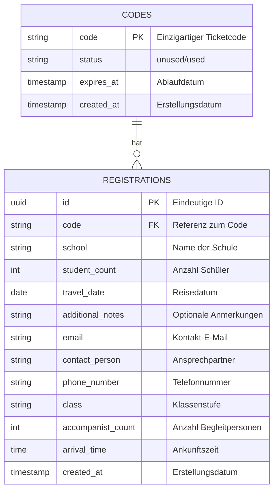
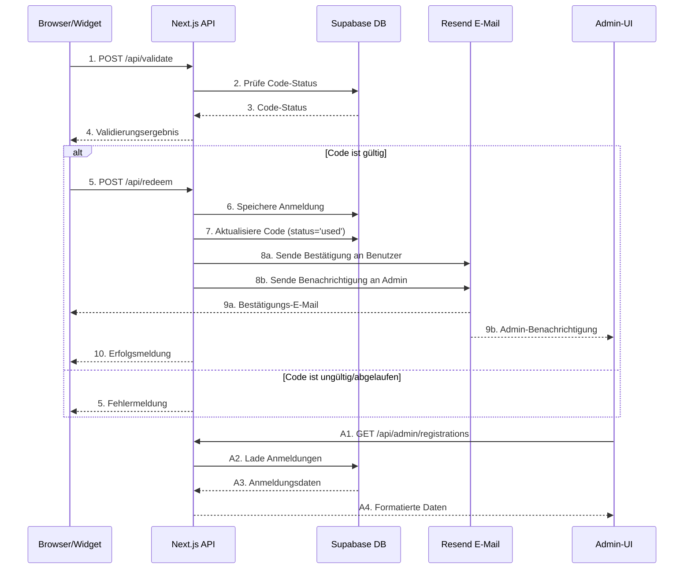

# Entdeckungsreise Widget für zvv.ch 🚆 🧭 🎒

## Inhaltsverzeichnis
- [Über das Projekt](#über-das-projekt)
- [Technologie-Stack](#technologie-stack)
- [Funktionalitäten](#funktionalitäten)
- [Datenbank-Struktur](#datenbank-struktur-supabase)
- [Erste Schritte](#erste-schritte-)
- [Widget-Integration](#widget-integration-)
- [Admin-Bereich](#admin-bereich-)
- [Best Practices](#best-practices)
- [Demo-Daten](#demo-daten)

## Über das Projekt 
Diese hochskalierbare Full-Stack-Microservice-Architektur kombiniert ein serverloses Backend mit einer event-driven Datenverarbeitungspipeline, optimiert für Performance, Skalierbarkeit und Sicherheit.
Das React-basierte Anmeldeformular für die ZVV-Entdeckungsreise läuft auf einer Next.js-Anwendung mit Server-Side Rendering (SSR) für eine schnelle und effiziente Verarbeitung. Die persistente Datenspeicherung erfolgt über eine PostgreSQL-Datenbank in Supabase, ergänzt durch Row-Level-Security (RLS) und API-gestützte Workflows zur nahtlosen Verwaltung von Bestellcodes.
Die Architektur setzt auf eine minimalistische, asynchrone Eventsteuerung, wobei Vercel Edge Functions eine niedrige Latenz und schnelle Code-Validierung gewährleisten.

## Technologie-Stack
- **Supabase (PostgreSQL)** als zentrale Datenbank für Speicherung & Validierung der Codes 🗄️
- **Next.js** für Frontend und API-Routes auf **Vercel** für optimale Performance 🚀
- **Vercel** für Hosting und Serverless-Funktionen mit automatischem Scaling ☁️
- **Resend** für zuverlässigen E-Mail-Versand von Bestätigungen und Benachrichtigungen 📧
- **shadcn/ui** für konsistentes, modernes und zugängliches UI-Design 🎨
- **Tailwind CSS** für effizientes, responsives Styling 🌈

## Funktionalitäten
### **1. Code-Validierung** ✅
- API-Endpunkt: `POST /api/validate`
- Überprüft, ob ein Ticketcode gültig ist.

### **2. Code-Einlösung mit Anmeldeformular** 📝
- Einfaches Formular mit folgenden Feldern:
  - Code
  - Schule
  - Kontaktperson
  - E-Mail-Adresse
  - Telefonnummer
  - Klasse (Dropdown-Menü)
  - Anzahl Schüler
  - Anzahl Begleitpersonen
  - Gewünschtes Reisedatum
  - Ankunftszeit
  - Zusätzliche Anmerkung
- API-Endpunkt: `POST /api/redeem`
- Validiert den Code und speichert die Anmeldedaten.

### **3. E-Mail-Benachrichtigungen** 📬
- **Bestätigungs-E-Mail** an den Benutzer nach erfolgreicher Anmeldung
  - Professionelles Layout mit ZVV-Branding
  - Übersichtliche Darstellung der Bestelldetails
  - Absender wird über Umgebungsvariablen konfiguriert
  - Betreff: "Ticketbestellung ZVV-Entdeckungsreise"
- **Benachrichtigungs-E-Mail** an den Administrator mit den Anmeldedetails
  - Detaillierte Informationen zur neuen Anmeldung
  - Direkte Antwortmöglichkeit an die Kontaktperson
- **Technische Details**
  - Zuverlässiger E-Mail-Versand über Resend API
  - Transaktionale E-Mails mit Zustellgarantie
  - HTML und Text-Versionen für maximale Kompatibilität
  - Automatische Bounce-Handling und Zustellberichte

### **4. Widget-Integration** 🔌
- **Standalone JavaScript-Widget** für die Integration in externe Websites.
- **Keine iframe-Einbindung** erforderlich, sondern direkte Integration als React-Komponente.
- **Konfigurierbare API-Basis-URL** für flexible Deployment-Szenarien.

### **5. Admin-Ansicht** 🔐
- Geschützte Seite unter `/admin` zur Überwachung der Anmeldungen.
- Tabellarische Übersicht aller Anmeldungen mit wichtigen Informationen.
- Modernes UI mit shadcn/ui-Komponenten für verbesserte Benutzerfreundlichkeit.
- Sicherer Login-Bereich mit Supabase Auth.

## Datenbank-Struktur (Supabase)

### Datenbankschema

Die Anwendung verwendet zwei Haupttabellen: `codes` für die Ticketcodes und `registrations` für die Anmeldungen.

#### ER-Diagramm



#### Sequenzdiagramm des Datenflusses



#### Tabellenstruktur

##### Tabelle: `codes`

| Spalte | Typ | Constraints | Beschreibung |
|--------|-----|-------------|-------------|
| code | TEXT | PRIMARY KEY | Einzigartiger Ticketcode |
| status | TEXT | DEFAULT 'unused', CHECK (status IN ('unused', 'used')) | Status des Codes (unused/used) |
| expires_at | TIMESTAMP | NOT NULL | Ablaufdatum des Codes (3 Jahre nach Erstellung) |
| created_at | TIMESTAMP | DEFAULT now() | Erstellungsdatum |

##### Tabelle: `registrations`

| Spalte | Typ | Constraints | Beschreibung |
|--------|-----|-------------|-------------|
| id | UUID | PRIMARY KEY, DEFAULT gen_random_uuid() | Eindeutige ID der Anmeldung |
| code | TEXT | REFERENCES codes(code) | Referenz zum eingelösten Code |
| school | TEXT | NOT NULL | Name der Schule |
| student_count | INTEGER | NOT NULL | Anzahl der Schüler |
| travel_date | DATE | NOT NULL | Gewünschtes Reisedatum |
| additional_notes | TEXT | | Zusätzliche Anmerkungen (optional) |
| email | TEXT | NOT NULL | E-Mail-Adresse für die Bestätigung |
| contact_person | TEXT | NOT NULL | Name der Kontaktperson |
| phone_number | TEXT | NOT NULL | Telefonnummer der Kontaktperson |
| class | TEXT | NOT NULL | Klassenstufe (z.B. "4. Klasse") |
| accompanist_count | INTEGER | NOT NULL | Anzahl der Begleitpersonen |
| arrival_time | TIME | NOT NULL | Geplante Ankunftszeit |
| created_at | TIMESTAMP | DEFAULT now() | Erstellungsdatum der Anmeldung |

#### Beziehungen

- Ein Code (`codes`) kann höchstens eine Anmeldung (`registrations`) haben (1:0..1)
- Eine Anmeldung (`registrations`) gehört genau zu einem Code (`codes`) (1:1)

### API-Dokumentation

#### 1. Code-Validierung
```http
POST /api/validate
```

**Request Body:**
```json
{
    "code": "string"
}
```

**Erfolgreiche Antwort (200 OK):**
```json
{
    "valid": true,
    "message": "Code ist gültig."
}
```

**Fehlerantworten:**
- `400 Bad Request`: Code fehlt
```json
{
    "valid": false,
    "message": "Code ist erforderlich."
}
```
- `404 Not Found`: Code existiert nicht
```json
{
    "valid": false,
    "message": "Ungültiger Code."
}
```
- `400 Bad Request`: Code bereits verwendet
```json
{
    "valid": false,
    "message": "Dieser Code wurde bereits verwendet."
}
```
- `400 Bad Request`: Code abgelaufen
```json
{
    "valid": false,
    "message": "Dieser Code ist abgelaufen."
}
```

#### 2. Code-Einlösung
```http
POST /api/redeem
```

**Request Body:**
```json
{
    "code": "string",
    "school": "string",
    "studentCount": "number",
    "travelDate": "string (YYYY-MM-DD)",
    "additionalNotes": "string?",
    "email": "string",
    "className": "string",
    "contactPerson": "string",
    "phoneNumber": "string",
    "accompanistCount": "number",
    "arrivalTime": "string (HH:mm)"
}
```

**Erfolgreiche Antwort (200 OK):**
```json
{
    "success": true,
    "message": "Anmeldung erfolgreich. Vielen Dank!",
    "data": {
        "registrationId": "uuid",
        "school": "string",
        "travelDate": "string",
        "emailSent": true
    }
}
```

**Fehlerantworten:**
- `400 Bad Request`: Fehlende Pflichtfelder
```json
{
    "success": false,
    "message": "Alle Pflichtfelder müssen ausgefüllt sein."
}
```
- `400 Bad Request`: Ungültige E-Mail
```json
{
    "success": false,
    "message": "Bitte gib eine gültige E-Mail-Adresse ein."
}
```
- `500 Internal Server Error`: Datenbankfehler
```json
{
    "success": false,
    "message": "Ein unerwarteter Fehler ist aufgetreten."
}
```

#### 3. Admin-Anmeldungen abrufen
```http
GET /api/admin/registrations
```

**Headers:**
```http
Authorization: Bearer <JWT_TOKEN>
```

**Erfolgreiche Antwort (200 OK):**
```json
{
    "registrations": [
        {
            "id": "uuid",
            "code": "string",
            "school": "string",
            "studentCount": "number",
            "travelDate": "string",
            "email": "string",
            "contactPerson": "string",
            "createdAt": "string"
        }
    ],
    "total": "number"
}
```

**Fehlerantworten:**
- `401 Unauthorized`: Fehlende/ungültige Authentifizierung
```json
{
    "error": "Nicht autorisiert"
}
```
- `403 Forbidden`: Keine Administratorrechte
```json
{
    "error": "Zugriff verweigert"
}
```

## Erste Schritte 🚀
1. Klone das Repository:
   ```bash
   git clone https://github.com/muraschal/zvv-entdeckungsreise.git
   cd zvv-entdeckungsreise
   ```

2. Installiere die Abhängigkeiten:
   ```bash
   npm install
   ```

3. Erstelle eine `.env.local` Datei mit den erforderlichen Umgebungsvariablen:
   ```
   NEXT_PUBLIC_SUPABASE_URL=deine-supabase-url
   SUPABASE_SERVICE_ROLE_KEY=dein-service-role-key
   NEXT_PUBLIC_SUPABASE_ANON_KEY=dein-anon-key
   RESEND_API_KEY=dein-resend-api-key
   EMAIL_FROM=deine-absender-email
   EMAIL_FROM_NAME=dein-absender-name
   ADMIN_EMAIL=deine-admin-email
   ```

   **Hinweis zur Konfiguration:**
   - `NEXT_PUBLIC_SUPABASE_URL`: Die URL deiner Supabase-Instanz
   - `SUPABASE_SERVICE_ROLE_KEY`: Der Service-Role-Key für den Zugriff auf die Supabase-Datenbank
   - `NEXT_PUBLIC_SUPABASE_ANON_KEY`: Der öffentliche Anon-Key für die Client-seitige Authentifizierung
   - `RESEND_API_KEY`: Der API-Key für den E-Mail-Versand über Resend
   - `EMAIL_FROM`: Die E-Mail-Adresse, die als Absender für alle E-Mails verwendet wird
   - `EMAIL_FROM_NAME`: Der Anzeigename für den E-Mail-Absender
   - `ADMIN_EMAIL`: Die E-Mail-Adresse für Admin-Benachrichtigungen und Reply-To

4. Starte die Entwicklungsumgebung:
   ```bash
   npm run dev
   ```

## Widget-Integration 🔌

### Standalone JavaScript-Widget bauen

Um das Widget als Standalone-JavaScript-Datei zu bauen, führe folgenden Befehl aus:

```bash
npm run build:standalone
```

Dies erstellt eine Datei `dist/zvv-entdeckungsreise-widget.js`, die in externe Websites eingebunden werden kann.

### Widget in eine Website einbinden

1. **Erforderliche Skripte einbinden:**

```html
<!-- React und ReactDOM einbinden (von CDN) -->
<script src="https://unpkg.com/react@18/umd/react.production.min.js" crossorigin></script>
<script src="https://unpkg.com/react-dom@18/umd/react-dom.production.min.js" crossorigin></script>

<!-- ZVV Entdeckungsreise Widget einbinden -->
<script src="https://entdeckungsreise.zvv.ch/zvv-entdeckungsreise-widget.js"></script>
```

2. **Container für das Widget erstellen:**

```html
<div id="zvv-entdeckungsreise-widget"></div>
```

3. **Widget initialisieren:**

```html
<script>
  document.addEventListener('DOMContentLoaded', function() {
    // Widget initialisieren
    window.initZVVEntdeckungsreiseWidget('zvv-entdeckungsreise-widget', {
      apiBaseUrl: 'https://entdeckungsreise.zvv.ch' // Optional: API-Basis-URL anpassen
    });
  });
</script>
```

### Konfigurationsoptionen

Das Widget akzeptiert folgende Konfigurationsoptionen:

| Option | Typ | Standard | Beschreibung |
|--------|-----|----------|-------------|
| apiBaseUrl | String | 'https://entdeckungsreise.zvv.ch' | Die Basis-URL für API-Anfragen |

### Beispiel

Ein vollständiges Beispiel für die Integration findest du in der Datei `examples/widget-integration.html`.

## Admin-Bereich 🔐

Der Admin-Bereich ist unter `/admin` erreichbar und bietet eine Übersicht über alle Anmeldungen.

### Funktionen des Admin-Bereichs

Der Admin-Bereich bietet folgende Funktionalitäten:

- **Anmeldungsübersicht**: Tabellarische Darstellung aller eingegangenen Anmeldungen
  - Sortier- und filterbare Tabelle mit allen wichtigen Informationen
  - Detailansicht für jede Anmeldung mit allen eingereichten Daten
  - Konsistente Spaltenbreiten und optimierte Darstellung für lange Inhalte
  - Horizontales Scrolling für bessere Übersicht auf kleineren Bildschirmen

- **Testcode-Verwaltung** (nur im INT-Environment): Verwaltung von Testcodes für Entwicklungs- und Testzwecke
  - Generierung von neuen Testcodes mit einem Klick
  - Automatische Bereinigung von Testcodes, die älter als 24 Stunden sind
  - Testcodes folgen dem Format `INT_VALID_YYYYMMDD_XXXXX`
  - Strikte Umgebungsprüfung: Funktionalität nur im INT-Environment verfügbar

- **Export-Funktionalität**: Export der Anmeldungsdaten als Excel-Datei
  - Vollständiger Export aller Anmeldungsdaten
  - Formatierte Excel-Datei mit allen relevanten Feldern

### Authentifizierung

Die Authentifizierung erfolgt über **Supabase Auth** mit folgenden Merkmalen:
- Sichere Benutzerauthentifizierung mit JWT-basierter Session-Verwaltung
- Direkter Datenbankzugriff mit Row-Level Security für maximale Sicherheit

### Admin-Benutzer erstellen

Um Admin-Benutzer zu erstellen:
1. Gehe zum Supabase Dashboard → Authentication → Users
2. Klicke auf "Add User" und gib E-Mail und Passwort ein
3. Der Benutzer erhält eine Einladungs-E-Mail zur Bestätigung

### E-Mail-Konfiguration und Tests

Die Anwendung verwendet **Resend** für den zuverlässigen Versand von E-Mails. Zum Testen der E-Mail-Funktionalität:

```bash
# Führe den E-Mail-Test aus
npm run test:email
```

Der Test sendet sowohl eine Bestätigungs-E-Mail als auch eine Admin-Benachrichtigung an die in den Umgebungsvariablen konfigurierten Adressen. Dies ist nützlich, um das E-Mail-Layout und die Zustellung zu überprüfen.

#### E-Mail-Layout

Die E-Mail-Templates bieten:
- Professionelles Layout mit ZVV-Branding und Farbschema
- Klare Struktur mit Überschriften "Danke für Ihre Ticketbestellung"
- Übersichtliche Darstellung aller Bestelldaten in einem strukturierten Format
- Responsives Design für optimale Anzeige auf allen Geräten

## Best Practices
- **Supabase Row-Level Security (RLS)** aktivieren, um Datenzugriff abzusichern 🔒
- **Serverless-Funktionen** für optimale Skalierbarkeit 📈
- **Formularvalidierung** sowohl client- als auch serverseitig ✓
- **Transaktionale E-Mails** für Bestätigungen und Benachrichtigungen 📩
- **Widget-Integration** ohne iframes für bessere Benutzererfahrung 🖼️

## Demo-Daten

Für Testzwecke können folgende Demo-Codes verwendet werden:

| Kategorie | Codes |
|-----------|-------|
| Test-Codes | `TEST123`, `TEST456`, `TEST789` |
| Schul-Codes | `SCHULE2023`, `SCHULE2024`, `SCHULE2025` |
| ZVV-Codes | `ZVV2023`, `ZVV2024`, `ZVV2025` |
| Präsentations-Codes | `DEMO001`, `DEMO002`, `DEMO003` |
| Regionale Codes | `ZUERICH01`, `ZUERICH02`, `WINTERTHUR01`, `WINTERTHUR02`, `USTER01`, `WETZIKON01`, `DIETIKON01`, `HORGEN01` |

Alle Demo-Codes sind für 3 Jahre gültig und können für Testzwecke verwendet werden.

### Datenbank einrichten

Um die Datenbank einzurichten und Demo-Codes einzufügen, verwende die Datei `setup-database.sql`:

```bash
# Verbinde dich mit deiner Supabase-Datenbank
psql -h db.abcdefghijklm.supabase.co -p 5432 -d postgres -U postgres

# Führe das SQL-Skript aus
\i setup-database.sql
```

Alternativ kannst du die SQL-Befehle auch direkt im Supabase SQL-Editor ausführen.
