# Entdeckungsreise Widget für zvv.ch 🚆 🧭 🎒

## Inhaltsverzeichnis
- [Über das Projekt](#über-das-projekt)
- [Architektur](#architektur)
- [Technologie-Stack](#technologie-stack)
- [Funktionalitäten](#funktionalitäten)
- [Datenbank-Struktur](#datenbank-struktur-supabase)
- [Erste Schritte](#erste-schritte-)
- [Widget-Integration](#widget-integration-)
- [Admin-Bereich](#admin-bereich-)
- [Best Practices](#best-practices)
- [Demo-Daten](#demo-daten)

## Über das Projekt 
Dieses hochskalierbare Full-Stack-Microservice implementiert ein React-basiertes Anmeldeformular für die ZVV-Entdeckungsreise mit serverless Backend-Architektur. Die Lösung nutzt eine event-driven Datenverarbeitungspipeline mit PostgreSQL als persistente Speicherschicht via **Supabase** und einer **Next.js-Anwendung** mit Server-Side Rendering für optimale Performance und SEO-Metriken.

## Architektur
- **Supabase (PostgreSQL)** als **zentrale Datenbank** für Codes und Anmeldungen 📊
- **Vercel (Next.js)** für die Benutzeroberfläche und API-Endpunkte 🖥️
- **Resend** für den E-Mail-Versand von Bestätigungen und Benachrichtigungen 📧
- **shadcn/ui** für moderne, zugängliche UI-Komponenten 🎨

## Technologie-Stack
- **Supabase (PostgreSQL)** für Speicherung & Validierung der Codes 🗄️
- **Next.js** für Frontend und API-Routes 🚀
- **Vercel** für Hosting und Serverless-Funktionen ☁️
- **Resend** für transaktionale E-Mails 📨
- **shadcn/ui** für konsistentes, modernes UI-Design 🎭
- **Tailwind CSS** für effizientes, responsives Styling 🌈

## Funktionalitäten
### **1. Code-Validierung** ✅
- API-Endpunkt: `POST /api/validate`
- Überprüft, ob ein Ticketcode gültig ist.

### **2. Code-Einlösung mit Anmeldeformular** 📝
- Einfaches Formular mit folgenden Feldern:
  - Code
  - Schule
  - Kontaktperson
  - E-Mail-Adresse
  - Telefonnummer
  - Klasse (Dropdown-Menü)
  - Anzahl Schüler
  - Anzahl Begleitpersonen
  - Gewünschtes Reisedatum
  - Ankunftszeit
  - Zusätzliche Anmerkung
- API-Endpunkt: `POST /api/redeem`
- Validiert den Code und speichert die Anmeldedaten.

### **3. E-Mail-Benachrichtigungen** 📬
- **Bestätigungs-E-Mail** an den Benutzer nach erfolgreicher Anmeldung.
- **Benachrichtigungs-E-Mail** an den Administrator mit den Anmeldedetails.

### **4. Widget-Integration** 🔌
- **Standalone JavaScript-Widget** für die Integration in externe Websites.
- **Keine iframe-Einbindung** erforderlich, sondern direkte Integration als React-Komponente.
- **Konfigurierbare API-Basis-URL** für flexible Deployment-Szenarien.

### **5. Admin-Ansicht** 🔐
- Geschützte Seite unter `/admin` zur Überwachung der Anmeldungen.
- Tabellarische Übersicht aller Anmeldungen mit wichtigen Informationen.
- Modernes UI mit shadcn/ui-Komponenten für verbesserte Benutzerfreundlichkeit.
- Sicherer Login-Bereich mit Supabase Auth.

## Datenbank-Struktur (Supabase)

### Datenbankschema

Die Anwendung verwendet zwei Haupttabellen: `codes` für die Ticketcodes und `registrations` für die Anmeldungen.

#### ER-Diagramm

```mermaid
erDiagram
    CODES ||--o{ REGISTRATIONS : "hat"
    
    CODES {
        string code PK "Einzigartiger Ticketcode"
        string status "unused/used"
        timestamp expires_at "Ablaufdatum"
        timestamp created_at "Erstellungsdatum"
    }
    
    REGISTRATIONS {
        uuid id PK "Eindeutige ID"
        string code FK "Referenz zum Code"
        string school "Name der Schule"
        int student_count "Anzahl Schüler"
        date travel_date "Reisedatum"
        string additional_notes "Optionale Anmerkungen"
        string email "Kontakt-E-Mail"
        string contact_person "Ansprechpartner"
        string phone_number "Telefonnummer"
        string class "Klassenstufe"
        int accompanist_count "Anzahl Begleitpersonen"
        time arrival_time "Ankunftszeit"
        timestamp created_at "Erstellungsdatum"
    }
```



#### Tabellenstruktur

##### Tabelle: `codes`

| Spalte | Typ | Constraints | Beschreibung |
|--------|-----|-------------|-------------|
| code | TEXT | PRIMARY KEY | Einzigartiger Ticketcode |
| status | TEXT | DEFAULT 'unused', CHECK (status IN ('unused', 'used')) | Status des Codes (unused/used) |
| expires_at | TIMESTAMP | NOT NULL | Ablaufdatum des Codes (3 Jahre nach Erstellung) |
| created_at | TIMESTAMP | DEFAULT now() | Erstellungsdatum |

##### Tabelle: `registrations`

| Spalte | Typ | Constraints | Beschreibung |
|--------|-----|-------------|-------------|
| id | UUID | PRIMARY KEY, DEFAULT gen_random_uuid() | Eindeutige ID der Anmeldung |
| code | TEXT | REFERENCES codes(code) | Referenz zum eingelösten Code |
| school | TEXT | NOT NULL | Name der Schule |
| student_count | INTEGER | NOT NULL | Anzahl der Schüler |
| travel_date | DATE | NOT NULL | Gewünschtes Reisedatum |
| additional_notes | TEXT | | Zusätzliche Anmerkungen (optional) |
| email | TEXT | NOT NULL | E-Mail-Adresse für die Bestätigung |
| contact_person | TEXT | NOT NULL | Name der Kontaktperson |
| phone_number | TEXT | NOT NULL | Telefonnummer der Kontaktperson |
| class | TEXT | NOT NULL | Klassenstufe (z.B. "4. Klasse") |
| accompanist_count | INTEGER | NOT NULL | Anzahl der Begleitpersonen |
| arrival_time | TIME | NOT NULL | Geplante Ankunftszeit |
| created_at | TIMESTAMP | DEFAULT now() | Erstellungsdatum der Anmeldung |

#### Beziehungen

- Ein Code (`codes`) kann höchstens eine Anmeldung (`registrations`) haben (1:0..1)
- Eine Anmeldung (`registrations`) gehört genau zu einem Code (`codes`) (1:1)

## Erste Schritte 🚀
1. Klone das Repository:
   ```bash
   git clone https://github.com/dein-username/zvv-entdeckungsreise.git
   cd zvv-entdeckungsreise
   ```

2. Installiere die Abhängigkeiten:
   ```bash
   npm install
   ```

3. Erstelle eine `.env.local` Datei mit den erforderlichen Umgebungsvariablen:
   ```
   NEXT_PUBLIC_SUPABASE_URL=deine-supabase-url
   SUPABASE_SERVICE_ROLE_KEY=dein-service-role-key
   NEXT_PUBLIC_SUPABASE_ANON_KEY=dein-anon-key
   RESEND_API_KEY=dein-resend-api-key
   EMAIL_FROM=noreply@zvv.ch
   ADMIN_EMAIL=ict@zvv.zh.ch
   ```

   **Hinweis zur Konfiguration:**
   - `NEXT_PUBLIC_SUPABASE_URL`: Die URL deiner Supabase-Instanz
   - `SUPABASE_SERVICE_ROLE_KEY`: Der Service-Role-Key für den Zugriff auf die Supabase-Datenbank
   - `NEXT_PUBLIC_SUPABASE_ANON_KEY`: Der öffentliche Anon-Key für die Client-seitige Authentifizierung
   - `EMAIL_FROM`: Die E-Mail-Adresse, die als Absender für alle E-Mails verwendet wird (z.B. `entdeckungsreise@zvv.ch`). Fallback: `noreply@zvv.ch`
   - `ADMIN_EMAIL`: Die E-Mail-Adresse, an die Benachrichtigungen über neue Anmeldungen gesendet werden und die als Reply-To-Adresse in den Bestätigungs-E-Mails verwendet wird. Fallback: `ict@zvv.zh.ch`

4. Starte die Entwicklungsumgebung:
   ```bash
   npm run dev
   ```

## Widget-Integration 🔌

### Standalone JavaScript-Widget bauen

Um das Widget als Standalone-JavaScript-Datei zu bauen, führe folgenden Befehl aus:

```bash
npm run build:standalone
```

Dies erstellt eine Datei `dist/zvv-entdeckungsreise-widget.js`, die in externe Websites eingebunden werden kann.

### Widget in eine Website einbinden

1. **Erforderliche Skripte einbinden:**

```html
<!-- React und ReactDOM einbinden (von CDN) -->
<script src="https://unpkg.com/react@18/umd/react.production.min.js" crossorigin></script>
<script src="https://unpkg.com/react-dom@18/umd/react-dom.production.min.js" crossorigin></script>

<!-- ZVV Entdeckungsreise Widget einbinden -->
<script src="https://entdeckungsreise.zvv.ch/zvv-entdeckungsreise-widget.js"></script>
```

2. **Container für das Widget erstellen:**

```html
<div id="zvv-entdeckungsreise-widget"></div>
```

3. **Widget initialisieren:**

```html
<script>
  document.addEventListener('DOMContentLoaded', function() {
    // Widget initialisieren
    window.initZVVEntdeckungsreiseWidget('zvv-entdeckungsreise-widget', {
      apiBaseUrl: 'https://entdeckungsreise.zvv.ch' // Optional: API-Basis-URL anpassen
    });
  });
</script>
```

### Konfigurationsoptionen

Das Widget akzeptiert folgende Konfigurationsoptionen:

| Option | Typ | Standard | Beschreibung |
|--------|-----|----------|-------------|
| apiBaseUrl | String | 'https://entdeckungsreise.zvv.ch' | Die Basis-URL für API-Anfragen |

### Beispiel

Ein vollständiges Beispiel für die Integration findest du in der Datei `examples/widget-integration.html`.

## Admin-Bereich 🔐

Der Admin-Bereich ist unter `/admin` erreichbar und bietet eine Übersicht über alle Anmeldungen.

### Authentifizierung

Die Authentifizierung erfolgt über **Supabase Auth** mit folgenden Merkmalen:
- Sichere Benutzerauthentifizierung mit JWT-basierter Session-Verwaltung
- Direkter Datenbankzugriff mit Row-Level Security für maximale Sicherheit

### Admin-Benutzer erstellen

Um Admin-Benutzer zu erstellen:
1. Gehe zum Supabase Dashboard → Authentication → Users
2. Klicke auf "Add User" und gib E-Mail und Passwort ein
3. Der Benutzer erhält eine Einladungs-E-Mail zur Bestätigung

## Best Practices
- **Supabase Row-Level Security (RLS)** aktivieren, um Datenzugriff abzusichern 🔒
- **Serverless-Funktionen** für optimale Skalierbarkeit 📈
- **Formularvalidierung** sowohl client- als auch serverseitig ✓
- **Transaktionale E-Mails** für Bestätigungen und Benachrichtigungen 📩
- **Widget-Integration** ohne iframes für bessere Benutzererfahrung 🖼️

## Demo-Daten

Für Testzwecke können folgende Demo-Codes verwendet werden:

| Kategorie | Codes |
|-----------|-------|
| Test-Codes | `TEST123`, `TEST456`, `TEST789` |
| Schul-Codes | `SCHULE2023`, `SCHULE2024`, `SCHULE2025` |
| ZVV-Codes | `ZVV2023`, `ZVV2024`, `ZVV2025` |
| Präsentations-Codes | `DEMO001`, `DEMO002`, `DEMO003` |
| Regionale Codes | `ZUERICH01`, `ZUERICH02`, `WINTERTHUR01`, `WINTERTHUR02`, `USTER01`, `WETZIKON01`, `DIETIKON01`, `HORGEN01` |

Alle Demo-Codes sind für 3 Jahre gültig und können für Testzwecke verwendet werden.

### Datenbank einrichten

Um die Datenbank einzurichten und Demo-Codes einzufügen, verwende die Datei `setup-database.sql`:

```bash
# Verbinde dich mit deiner Supabase-Datenbank
psql -h db.abcdefghijklm.supabase.co -p 5432 -d postgres -U postgres

# Führe das SQL-Skript aus
\i setup-database.sql
```

Alternativ kannst du die SQL-Befehle auch direkt im Supabase SQL-Editor ausführen.
